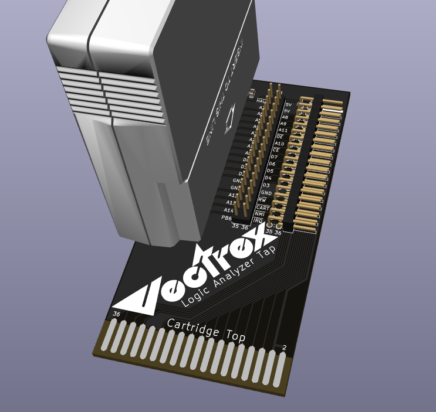

Vectrex LA TAP
===

A logic analyzer tap for the Vectrex.  It also turns the cartridge to face the player.
Populate either the right-angle or straight male header for connections, or both.  I prefer the right-angle to keep the jumpers lower to the table where your logic analyzer is located.  This can also be used as a quick way to add RAM to a game if you don't have a multicart like [VEXTREME](https://github.com/technobly/VEXTREME) that can do that for you programmatically.

See it in action here:
https://www.youtube.com/watch?v=Tel6ZxioI6E

BOM and Parts ordering
===

- 1x - 36-pin Edge Connector [AMP 5645235-4](https://www.digikey.com/en/products/detail/te-connectivity-amp-connectors/5645235-4/1122061)

Optional Components
- 1x - 36-pin 2.54 mm dual-row right-angle male header [PH2RA-36-UA](https://www.digikey.com/en/products/detail/adam-tech/PH2RA-36-UA/9830520)
- 1x - 36-pin 2.54 mm dual-row straight male header [PRPC018DAAN-RC](https://www.digikey.com/en/products/detail/sullins-connector-solutions/PRPC018DAAN-RC/2775276)
- 1x - [0.1uF 0805 capacitor](https://www.digikey.com/en/products/detail/avx-corporation/08055C104KAT2A/563505)

Ordering PCB's
===

OSHPark is a good place to order with purple or the new "after dark" theme color scheme.  You can upload the KiCad `vextrex-la-tap.kicad_pcb` there directly.  I would download this entire Github repo ZIP file first though instead of just trying to save the PCB file from your browser.

Another way to order PCB's is by using the included [gerbers](gerbers/vectrex-la-tap-v1.0.zip) and uploading those with all of the necessary specs to companies like [PCBWay](https://www.pcbway.com) or [JLCPCB](https://jlcpcb.com)

If you want to make it fancy, don't forget to make your board finish ENIG (gold flash) with a 45 degree chamfered edge.  I ended up making these really cheap with HASL finish since I won't be using them that frequently.

LICENSE
===

Creative Commons Attribution-ShareAlike 4.0 International (CC BY-SA 4.0) - essentially do whatever you want, and if this is helpful to you [consider buying me a coffee](https://buymeacoffee.com/walach)  Full [LICENSE here](LICENSE)
